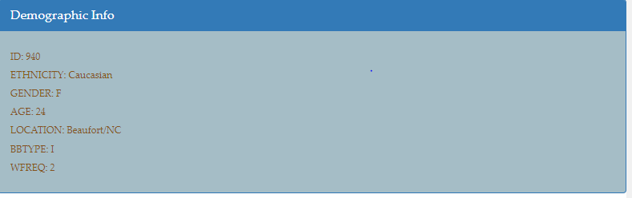

## Exploring Microbes that colonize Human Navels

This project catalogs the microbes that colonize the human navels. 

It concludes that a handful of microbial specifies (also called operational taxonomic units or OTUs) are present in the navels in a large percentage of the human population.

It uses a responsive HTML view presenting the horizontal bar chart . a bubble chart and a gauge to depict the results.

|  |
| ------------------------------------------------------------ |
|  |
|  |
|  |
|  |
